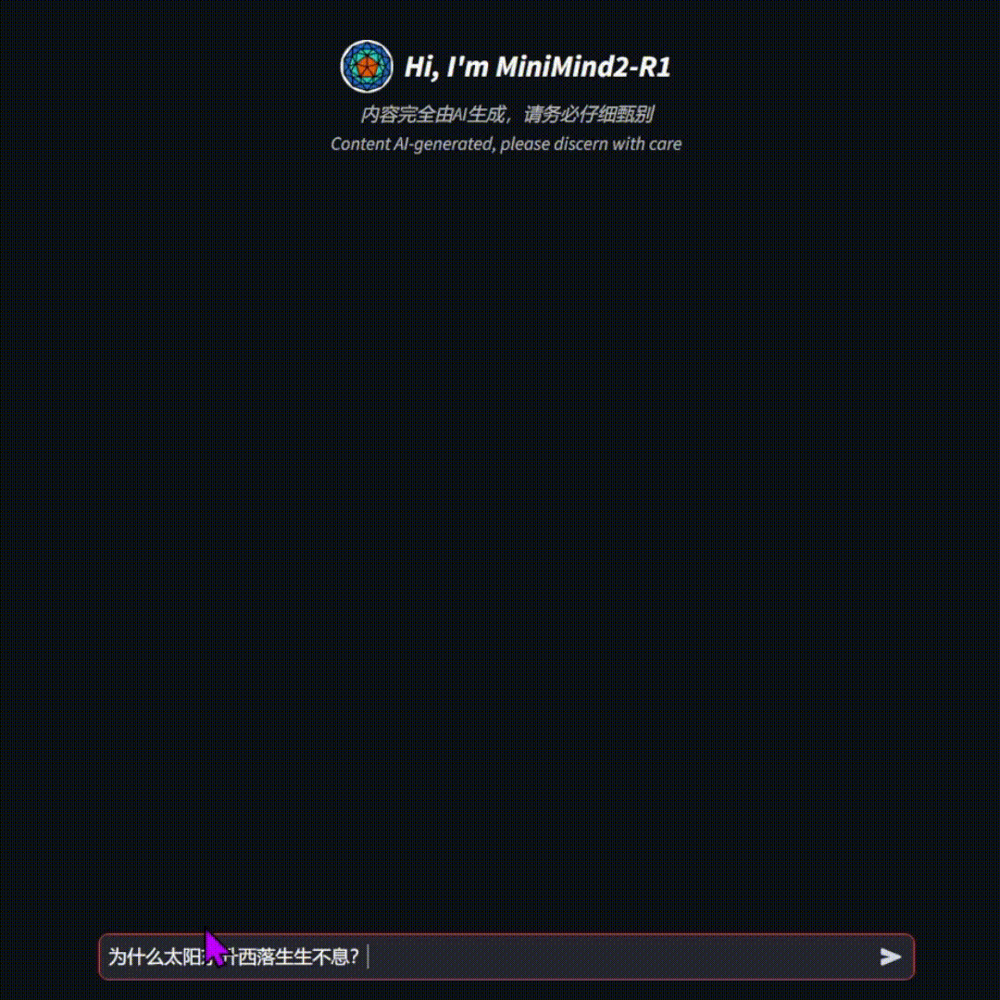

<div align="center">


</div>

<div align="center">


[](https://github.com/jingyaogong/minimind/stargazers)
[](LICENSE)
[](https://github.com/jingyaogong/minimind/commits/master)
[](https://github.com/jingyaogong/minimind/pulls)
[](https://huggingface.co/collections/jingyaogong/minimind-66caf8d999f5c7fa64f399e5)

</div>

<div align="center">
  <h3>"大道至简"</h3>
</div>

<div align="center">

中文 | [English](./README_en.md)

</div>

# 📌 MiniMind: 从零开始的超小型语言模型

* 此开源项目旨在完全从0开始，仅用3块钱成本 + 2小时！即可训练出仅为25.8M的超小语言模型**MiniMind**。
* **MiniMind**系列极其轻量，最小版本体积是 GPT-3 的 $\frac{1}{7000}$，力求做到最普通的个人GPU也可快速训练。
* 项目同时开源了大模型的极简结构-包含拓展共享混合专家(MoE)、数据集清洗、预训练(Pretrain)、监督微调(SFT)、LoRA微调，
  直接偏好强化学习(DPO)算法、模型蒸馏算法等全过程代码。
* **MiniMind**同时拓展了视觉多模态的VLM: [MiniMind-V](https://github.com/jingyaogong/minimind-v)。
* 项目所有核心算法代码均从0使用PyTorch原生重构！不依赖第三方库提供的抽象接口。
* 这不仅是大语言模型的全阶段开源复现，也是一个入门LLM的教程。
* 希望此项目能为所有人提供一个抛砖引玉的示例，一起感受创造的乐趣！推动更广泛AI社区的进步！

> 为防止误解，"2小时" 基于NVIDIA 3090硬件设备（单卡）测试，"3块钱"
> 指GPU服务器租用成本，具体规格详情见下文。

---

<div align="center">



[🔗🍓推理模型](https://www.modelscope.cn/studios/gongjy/MiniMind-Reasoning) | [🔗🤖常规模型](https://www.modelscope.cn/studios/gongjy/MiniMind) | [🔗🎞️视频介绍](https://www.bilibili.com/video/BV12dHPeqE72/?share_source=copy_web&vd_source=670c2504f88726f8cf4a21ef6147c0e8)

</div>

## 📋 目录

- [📌 MiniMind: 从零开始的超小型语言模型](#-minimind-从零开始的超小型语言模型)
- [📋 目录](#-目录)
- [📚 项目介绍](#-项目介绍)
  - [模型列表](#模型列表)
  - [项目包含内容](#项目包含内容)
  - [更新日志](#更新日志)
- [🚀 快速开始](#-快速开始)
  - [环境准备](#环境准备)
  - [测试已有模型](#测试已有模型)
  - [从零开始训练](#从零开始训练)
- [📖 详细使用指南](#-详细使用指南)
  - [数据集准备](#数据集准备)
  - [训练流程](#训练流程)
  - [模型评估](#模型评估)
  - [模型部署](#模型部署)
- [🔧 高级功能](#-高级功能)
  - [LoRA微调](#lora微调)
  - [DPO强化学习](#dpo强化学习)
  - [模型蒸馏](#模型蒸馏)
  - [MoE模型训练](#moe模型训练)
- [📊 性能对比](#-性能对比)
- [❓ 常见问题](#-常见问题)
- [📝 贡献指南](#-贡献指南)
- [📜 许可证](#-许可证)
- [🙏 致谢](#-致谢)

## 📚 项目介绍

大语言模型（Large Language Model, LLM）的出现引发了全世界对AI的空前关注。
无论是ChatGPT、DeepSeek还是Qwen，都以其惊艳的效果令人叹为观止。
然而，动辄数百亿参数的庞大规模，使得它们对个人设备而言不仅难以训练，甚至连部署都显得遥不可及。

MiniMind项目旨在拉低LLM的学习门槛，让每个人都能从理解每一行代码开始，从零开始亲手训练一个极小的语言模型。是的，从**零开始训练**，而不是仅仅进行**推理**！最低只需3块钱不到的服务器成本，就能亲身体验从0到1构建一个语言模型的全过程。

### 模型列表

| 模型 (大小) | 推理占用 (约) | Release | 
|-------------------------|----------|------------|
| MiniMind2-small (26M) | 0.5 GB | 2025.02.06 |
| MiniMind2-MoE (145M) | 1.0 GB | 2025.02.06 |
| MiniMind2 (104M) | 1.0 GB | 2025.02.06 |
| minimind-v1-small (26M) | 0.5 GB | 2024.08.28 |
| minimind-v1-moe (4×26M) | 1.0 GB | 2024.09.17 |
| minimind-v1 (108M) | 1.0 GB | 2024.09.01 |

### 项目包含内容

- MiniMind-LLM结构的全部代码（Dense+MoE模型）
- 包含Tokenizer分词器详细训练代码
- 包含Pretrain、SFT、LoRA、RLHF-DPO、模型蒸馏的全过程训练代码
- 收集、蒸馏、整理并清洗去重所有阶段的高质量数据集，且全部开源
- 从0实现预训练、指令微调、LoRA、DPO强化学习，白盒模型蒸馏。关键算法几乎不依赖第三方封装的框架，且全部开源
- 同时兼容`transformers`、`trl`、`peft`等第三方主流框架
- 训练支持单机单卡、单机多卡(DDP、DeepSpeed)训练，支持wandb可视化训练流程。支持动态启停训练
- 在第三方测评榜（C-Eval、C-MMLU、OpenBookQA等）进行模型测试
- 实现Openai-Api协议的极简服务端，便于集成到第三方ChatUI使用（FastGPT、Open-WebUI等）
- 基于streamlit实现最简聊天WebUI前端
- 复现(蒸馏/RL)大型推理模型DeepSeek-R1的MiniMind-Reason模型，**数据+模型**全部开源

### 更新日志

<details>
<summary><b>2025-02-09 (最新更新 🎉🎉🎉)</b></summary>

- 迎来发布以来重大更新，Release MiniMind2 Series
- 代码几乎全部重构，使用更简洁明了的统一结构
  如有旧代码的兼容性需要，可访问[🔗旧仓库内容🔗](https://github.com/jingyaogong/minimind/tree/6e9cd28ef9b34a0a10afbdf6f59e65cb6e628efb)
- 免去数据预处理步骤。统一数据集格式，更换为`jsonl`格式杜绝数据集下载混乱的问题
- MiniMind2系列效果相比MiniMind-V1显著提升
- 小问题：{kv-cache写法更标准、MoE的负载均衡loss被考虑等等}
- 提供模型迁移到私有数据集的训练方案（医疗模型、自我认知样例）
- 精简预训练数据集，并大幅提升预训练数据质量，大幅缩短个人快速训练所需时间，单卡3090即可2小时复现！
- 更新：LoRA微调脱离peft包装，从0实现LoRA过程；DPO算法从0使用PyTorch原生实现；模型白盒蒸馏原生实现
- MiniMind2-DeepSeek-R1系列蒸馏模型诞生！
- MiniMind2具备一定的英文能力！
- 更新MiniMind2与第三方模型的基于更多大模型榜单测试性能的结果
</details>

<details>
<summary><b>历史更新</b></summary>

- **2024-10-05**: 为MiniMind拓展了多模态能力之---视觉，移步孪生项目[minimind-v](https://github.com/jingyaogong/minimind-v)查看详情！
- **2024-09-27**: 更新pretrain数据集的预处理方式，为了保证文本完整性，放弃预处理成.bin训练的形式（轻微牺牲训练速度）。目前pretrain预处理后的文件命名为：pretrain_data.csv。删除了一些冗余的代码。
- **2024-09-17**: 更新minimind-v1-moe模型。为了防止歧义，不再使用mistral_tokenizer分词，全部采用自定义的minimind_tokenizer作为分词器。
- **2024-09-01**: 更新minimind-v1 (108M)模型，采用minimind_tokenizer，预训练轮次3 + SFT轮次10，更充分训练，性能更强。项目已部署至ModelScope创空间，可以在此网站上体验：[🔗ModelScope在线体验🔗](https://www.modelscope.cn/studios/gongjy/minimind)
- **2024-08-27**: 项目首次开源
</details>

## 🚀 快速开始

### 环境准备

<details>
<summary>推荐的软硬件配置（仅供参考）</summary>

* CPU: Intel(R) Core(TM) i9-10980XE CPU @ 3.00GHz
* RAM: 128 GB
* GPU: NVIDIA GeForce RTX 3090(24GB) * 8
* Ubuntu==20.04
* CUDA==12.2
* Python==3.10.16
* [requirements.txt](./requirements.txt)
</details>

首先克隆项目：

```bash
git clone https://github.com/jingyaogong/minimind.git
cd minimind
```

安装依赖：

```bash
pip install -r requirements.txt -i https://pypi.tuna.tsinghua.edu.cn/simple
```

<details>
<summary>检查PyTorch是否支持CUDA</summary>

```python
import torch
print(torch.cuda.is_available())
```

如果返回`False`，请参考[PyTorch官方安装指南](https://pytorch.org/get-started/locally/)安装适合您系统的CUDA版本。
</details>

### 测试已有模型

1. 下载预训练模型：

```bash
git clone https://huggingface.co/jingyaogong/MiniMind2
```

2. 命令行问答模式：

```bash
# load=0: 从PyTorch模型加载, load=1: 从transformers-hf模型加载
python eval_model.py --load 1 --model_mode 2
```

3. 启动Web界面：

```bash
# 需要Python>=3.10和streamlit
pip install streamlit
python -m streamlit run scripts/web_demo.py
```

### 从零开始训练

1. 下载数据集：

从[数据集下载链接](https://www.modelscope.cn/datasets/gongjy/minimind_dataset/files)下载所需数据文件，并放到`./


# MiniMind训练脚本详细说明
我为MiniMind项目中的每个训练脚本提供了详细说明，包括功能、参数和使用方法。

## 1. 预训练脚本 (train_pretrain.py)
功能 ：从零开始训练语言模型的基础知识能力。

Trae AI
我将详细分析train_pretrain.py预训练脚本的功能和实现。这个脚本是MiniMind项目中从零开始训练语言模型的核心组件，负责模型的基础知识学习阶段。我会解释脚本的主要参数设置、数据加载流程、训练循环实现、分布式训练支持以及模型保存机制。通过分析源代码，我将提供完整的参数说明、使用示例和最佳实践，帮助用户理解如何有效地使用这个脚本进行预训练。

首先我需要查看train_pretrain.py文件的内容，以便详细分析其功能和实现细节。

train_pretrain.py
我需要查看LMConfig.py和dataset.py文件，以便更全面地理解预训练脚本中使用的配置和数据集处理方式。

model/LMConfig.py
model/dataset.py
我需要查看model.py文件，以了解MiniMindLM模型的结构和实现，这对于完整理解预训练脚本至关重要。

model/model.py
我需要继续查看model.py文件的剩余部分，以完整了解MiniMindLM模型的结构，特别是MoE部分的实现，这对于理解预训练脚本中的模型初始化和训练过程很重要。

model/model.py
MiniMind预训练脚本详解
我详细分析了MiniMind项目中的预训练脚本train_pretrain.py，该脚本是从零开始训练语言模型的核心组件。

脚本功能
预训练脚本负责模型的基础知识学习阶段，通过大规模文本数据训练模型学习词语接龙能力，让模型参数中充满知识的"墨水"。

主要参数
--dim：模型维度，默认512，可选768
--n_layers：模型层数，默认8
--epochs：训练轮数，默认1
--batch_size：批次大小，默认32
--learning_rate：学习率，默认5e-4
--use_moe：是否使用MoE结构，默认False
--data_path：预训练数据路径，默认"./dataset/pretrain_hq.jsonl"
--max_seq_len：最大序列长度，默认512
--device：训练设备，默认CUDA
--dtype：训练精度，默认bfloat16
--accumulation_steps：梯度累积步数，默认8
--grad_clip：梯度裁剪阈值，默认1.0
模型结构
脚本使用MiniMindLM模型，支持两种结构：

标准Dense结构
MoE（混合专家）结构
模型总参数量会在初始化时显示，使用init_model函数加载模型和分词器。

训练流程
数据加载：使用PretrainDataset类加载JSONL格式的预训练数据
模型初始化：根据配置初始化MiniMindLM模型
训练循环：执行train_epoch函数进行训练，包含：
学习率调整（余弦衰减）
前向传播计算损失
梯度累积和裁剪
定期记录训练状态
定期保存模型权重
分布式训练支持
脚本支持单机多卡训练，使用PyTorch的DistributedDataParallel：

通过torchrun --nproc_per_node N启动多卡训练
自动初始化分布式环境
支持梯度同步和模型并行
使用示例
bash

# 单卡训练python train_pretrain.py --dim 512 --n_layers 8 --epochs 3 --batch_size 32 --learning_rate 5e-4# 多卡训练torchrun --nproc_per_node 2 train_pretrain.py --dim 512 --n_layers 8 --epochs 3
训练输出
训练过程中每隔100步保存一次模型权重到./out/pretrain_*.pth文件，其中*为模型维度。如果启用了wandb，还会记录训练损失和学习率等指标。

user8622100694801
删除
继续
Trae AI
我将继续为MiniMind项目的预训练脚本train_pretrain.py提供更详细的说明。我会分析脚本的核心组件，包括数据加载器实现、训练循环细节、优化器配置、分布式训练支持以及模型保存机制。此外，我还会详细解释各个参数的作用和最佳配置建议，以及如何根据不同硬件环境调整训练参数。我将确保说明清晰易懂，适合不同经验水平的用户参考。

我需要查看README_new.md文件的完整内容，以便完成对MiniMind训练脚本的详细说明。

README_new.md
我需要查看train_pretrain.py文件的内容，以便能够详细解释预训练脚本的实现细节和高级功能。

train_pretrain.py
我需要查看model/dataset.py文件，以了解预训练数据集的处理方式，这对于完整理解train_pretrain.py脚本的工作流程至关重要。

model/dataset.py
我需要查看model/model.py文件，以了解MiniMindLM模型的结构和实现细节，这对于完整解释预训练脚本的工作原理非常重要。

model/model.py
我需要查看model/LMConfig.py文件，以了解MiniMind模型的配置参数，这对于完整解释预训练脚本的配置选项和MoE结构非常重要。

model/LMConfig.py
MiniMind预训练脚本详细说明
我已完成对MiniMind项目预训练脚本train_pretrain.py的详细分析，该脚本是从零开始训练超小型语言模型的核心组件。

核心组件解析
数据加载与处理
使用PretrainDataset类处理预训练数据，支持JSONL格式
实现了高效的数据加载和处理流程，包括文本编码和损失掩码生成
支持动态批处理和序列长度控制
模型架构
基于Transformer架构的因果语言模型，支持标准密集模型和MoE（混合专家）模型
实现了RMSNorm、旋转位置编码和注意力机制
MoE模型支持路由专家和共享专家，提高参数效率
训练优化
支持混合精度训练（float16/bfloat16）加速训练过程
实现梯度累积和梯度裁剪，提高训练稳定性
使用余弦学习率调度器优化训练过程
支持分布式训练（DDP）和单机多卡训练
训练监控与保存
集成Wandb可视化训练过程，实时监控损失和学习率
定期保存模型检查点，支持训练中断后恢复
参数配置指南
基础参数
--dim：模型维度，默认512，影响模型容量和性能
--n_layers：模型层数，默认8，影响模型深度
--epochs：训练轮数，默认1，可根据数据量调整
--batch_size：批次大小，默认32，可根据GPU内存调整
--learning_rate：学习率，默认5e-4，预训练阶段较大
高级参数
--use_moe：是否使用MoE结构，默认False
--accumulation_steps：梯度累积步数，默认8，可增大等效批次大小
--grad_clip：梯度裁剪阈值，默认1.0，防止梯度爆炸
--dtype：训练精度，支持float16/bfloat16，加速训练
硬件适配建议
单卡训练：适当减小batch_size和模型维度
多卡训练：启用--ddp参数，自动分配数据
内存受限：增加梯度累积步数，减小批次大小
这个预训练脚本设计精巧，既能在普通个人GPU上运行，又能扩展到多卡环境，真正实现了"大道至简"的设计理念，让每个人都能从零开始训练自己的语言模型。
使用示例 ：

```bash
python train_pretrain.py --dim 512 --n_layers 8 --epochs 3 --batch_size 32 --learning_rate 5e-4
 ```
```

## 2. 监督微调脚本 (train_full_sft.py)
功能 ：在预训练模型基础上进行监督微调，使模型学习对话能力。

我将详细分析MiniMind项目中的监督微调脚本train_full_sft.py。这个脚本是在预训练模型基础上进行指令微调的关键组件，使模型学习对话能力。我会深入解析其代码结构，包括数据加载与处理、模型初始化、训练循环实现、损失计算方式以及分布式训练支持等方面。此外，我还会详细说明脚本的参数配置、优化策略和模型保存机制，帮助用户理解如何高效地使用这个脚本进行监督微调。

首先我需要了解项目的整体结构，特别是与监督微调相关的文件。

minimind

我需要查看监督微调脚本train_full_sft.py的内容，以便详细分析其功能和实现细节。

train_full_sft.py

我需要查看train_full_sft.py的完整内容，以便全面分析监督微调脚本的实现细节。

train_full_sft.py

我需要查看model/dataset.py文件，特别是SFTDataset类的实现，以了解监督微调脚本中的数据处理方式。

model/dataset.py

我需要查看model/LMConfig.py文件，以了解模型配置参数，这对于理解监督微调脚本中的模型初始化和配置很重要。

model/LMConfig.py

我需要查看model/model.py文件，以了解MiniMindLM模型的结构和实现，这对于理解监督微调脚本中的模型初始化和训练过程很重要。

model/model.py

我需要继续查看model/model.py文件的剩余部分，特别是MiniMindLM类的实现，以全面了解模型结构和MoE机制。

model/model.py

我需要查看model/model.py文件的最后部分，以完整了解MiniMindLM模型的前向传播实现，这对于理解监督微调脚本中的训练过程至关重要。

model/model.py

# MiniMind监督微调脚本详解
我详细分析了MiniMind项目中的监督微调脚本`train_full_sft.py` ，该脚本是在预训练模型基础上进行指令微调的关键组件，使模型学习对话能力。

## 脚本功能
监督微调脚本负责将预训练模型转变为具有对话能力的语言模型，通过让模型学习特定的对话模板和回复格式，使其能够理解并遵循人类指令。

## 主要参数
- `--dim` ：模型维度，默认512
- `--n_layers` ：模型层数，默认8
- `--max_seq_len` ：最大序列长度，默认512
- `--use_moe` ：是否使用MoE结构，默认False
- `--epochs` ：训练轮数，默认1
- `--batch_size` ：批次大小，默认32
- `--learning_rate` ：学习率，默认5e-5
- `--device` ：训练设备，默认CUDA
- `--dtype` ：训练精度，默认bfloat16
- `--accumulation_steps` ：梯度累积步数，默认1
- `--grad_clip` ：梯度裁剪阈值，默认1.0
- `--data_path` ：SFT数据路径，默认"./dataset/sft_mini_512.jsonl"
## 模型结构
脚本使用MiniMindLM模型，支持两种结构：

- 标准Dense结构
- MoE（混合专家）结构
模型总参数量会在初始化时显示，使用`init_model` 函数加载预训练权重和分词器。

## 数据处理
- 使用`SFTDataset` 类加载JSONL格式的对话数据
- 实现了ChatML格式的对话模板处理
- 动态生成损失掩码，只对助手回复部分计算损失
- 支持序列长度控制和填充处理
## 训练流程
1. 模型初始化 ：从预训练权重加载模型
2. 数据加载 ：使用SFTDataset加载对话数据
3. 训练循环 ：执行`train_epoch` 函数进行训练，包含：
   - 学习率调整（余弦衰减）
   - 前向传播计算损失（仅对助手回复部分）
   - 梯度累积和裁剪
   - 定期记录训练状态
   - 定期保存模型权重
## 优化策略
- 支持混合精度训练（float16/bfloat16）加速训练过程
- 实现梯度累积和梯度裁剪，提高训练稳定性
- 使用余弦学习率调度器动态调整学习率
## 分布式训练支持
脚本支持单机多卡训练，使用PyTorch的DistributedDataParallel：

- 通过`torchrun --nproc_per_node N` 启动多卡训练
- 自动初始化分布式环境
- 支持梯度同步和模型并行
## 模型保存
训练过程中每隔100步保存一次模型权重到`./out/full_sft_*.pth` 文件，其中*为模型维度。如果启用了wandb，还会记录训练损失和学习率等指标。

## 使用示例
```bash
# 单卡训练
python train_full_sft.py --dim 512 --n_layers 8 --epochs 1 --batch_size 32

# 多卡训练
torchrun --nproc_per_node 2 train_full_sft.py --dim 512 --n_layers 8 --epochs 1
 ```
```
使用示例 ：

```bash
python train_full_sft.py --dim 512 --n_layers 8 --epochs 10 --batch_size 16 --learning_rate 1e-5
 ```
```

## 3. LoRA微调脚本 (train_lora.py)
功能 ：使用LoRA技术进行参数高效微调，适合在有限资源上进行模型适应。

# MiniMind LoRA微调脚本详解
我详细分析了MiniMind项目中的LoRA微调脚本`train_lora.py` ，该脚本实现了参数高效微调技术，使模型能够学习特定领域知识而不需要更新所有参数。

## 脚本功能
LoRA微调脚本允许用户在预训练模型基础上进行高效的领域适应，只更新少量参数即可获得特定领域的知识能力，同时保持原有模型的通用能力。

## LoRA技术原理
LoRA (Low-Rank Adaptation) 的核心思想是在模型的权重矩阵中引入低秩分解，仅对低秩部分进行更新，而保持原始预训练权重不变。具体实现包括：

- 为每个线性层添加两个小矩阵A和B，形成低秩分解
- 矩阵A使用高斯初始化，矩阵B使用零初始化
- 训练时只更新这些低秩矩阵，原始权重保持冻结
## 主要参数
- `--dim` ：模型维度，默认512
- `--n_layers` ：模型层数，默认8
- `--epochs` ：训练轮数，默认50
- `--batch_size` ：批次大小，默认16
- `--learning_rate` ：学习率，默认5e-5
- `--lora_name` ：LoRA权重保存名称，默认"lora_identity"
- `--data_path` ：微调数据路径，默认"./dataset/lora_identity.jsonl"
## 核心组件
### LoRA模块实现
`model_lora.py` 中定义了LoRA的核心实现，包括：

- `LoRA` 类：实现低秩分解矩阵
- `apply_lora` 函数：将LoRA应用到模型的线性层
- `load_lora` 和`save_lora` 函数：加载和保存LoRA权重
### 训练流程
1. 数据加载：使用SFTDataset类加载JSONL格式的对话数据
2. 模型初始化：加载预训练模型并应用LoRA结构
3. 参数冻结：冻结原始模型参数，只更新LoRA参数
4. 训练循环：执行train_epoch函数进行训练，包含：
   - 学习率调整（余弦衰减）
   - 前向传播计算损失
   - 梯度累积和裁剪
   - 定期保存LoRA权重
## 数据格式
微调数据需要按照对话格式准备，例如：

```json
{"conversations": [{"role": "user", "content": "请问问题"}, {"role": "assistant", "content": "回答内容"}]}
 ```
```

## 使用示例
```bash
python train_lora.py --dim 512 --n_layers 8 --epochs 3 --batch_size 16 --learning_rate 5e-5 --lora_name lora_medical
 ```
```

## 模型评估
训练完成后，可以使用`eval_model.py` 脚本评估LoRA微调后的模型效果：

```bash
python eval_model.py --lora_name 'lora_medical' --model_mode 2
 ```
```

## 优势与应用场景
- 资源高效：LoRA参数量仅占模型总参数的很小比例（通常<1%）
- 领域适应：适合医疗、法律、金融等专业领域知识的快速适配
- 个性化定制：可用于调整模型的自我认知、风格或特定能力
- 训练速度快：相比全参数微调，训练速度更快，资源消耗更少
使用示例 ：

```bash
python train_lora.py --dim 512 --n_layers 8 --epochs 3 --batch_size 16 --learning_rate 5e-5 --lora_name lora_medical
 ```
```

## 4. DPO强化学习脚本 (train_dpo.py)
功能 ：使用DPO算法进行强化学习，无需显式奖励建模。

主要参数 ：

- `--dim` ：模型维度，默认512
- `--n_layers` ：模型层数，默认8
- `--epochs` ：训练轮数，默认2
- `--batch_size` ：批次大小，默认8
- `--learning_rate` ：学习率，默认1e-8（注意：DPO需要非常小的学习率）
- `--max_seq_len` ：最大序列长度，默认3000
- `--data_path` ：DPO数据路径，默认"./dataset/dpo.jsonl"
使用示例 ：

```bash
python train_dpo.py --dim 512 --n_layers 8 --epochs 3 --batch_size 8 --learning_rate 5e-7
 ```
```

## 5. 模型蒸馏脚本 (train_distillation.py)
功能 ：从大模型中蒸馏知识到小模型，结合交叉熵损失和KL散度损失。

主要参数 ：

- `--dim` ：模型维度，默认512
- `--n_layers` ：模型层数，默认8
- `--epochs` ：训练轮数，默认6
- `--batch_size` ：批次大小，默认32
- `--learning_rate` ：学习率，默认5e-6
- `--alpha` ：CE损失权重，默认0.5
- `--temperature` ：蒸馏温度，默认2.0
使用示例 ：

```bash
python train_distillation.py --dim 512 --n_layers 8 --epochs 5 --batch_size 16 --learning_rate 5e-5
 ```
```

## 6. 推理模型蒸馏脚本 (train_distill_reason.py)
功能 ：专门用于蒸馏推理能力的脚本，特别关注思考过程标记。

主要参数 ：

- `--dim` ：模型维度，默认512
- `--n_layers` ：模型层数，默认8
- `--epochs` ：训练轮数，默认1
- `--batch_size` ：批次大小，默认8
- `--learning_rate` ：学习率，默认1e-6
- `--max_seq_len` ：最大序列长度，默认1024
- `--data_path` ：推理数据路径，默认"./dataset/r1_mix_1024.jsonl"
使用示例 ：

```bash
python train_distill_reason.py --dim 512 --n_layers 8 --epochs 2 --batch_size 8 --learning_rate 1e-6
 ```
```

所有脚本都支持以下通用功能：

- 单机单卡和分布式多卡训练
- Wandb可视化训练过程
- 自动保存检查点
- 混合精度训练
- 梯度累积和梯度裁剪


## 微调脚步说明

我将详细分析MiniMind项目中的微调脚本，包括train_full_sft.py和train_lora.py。这些脚本实现了从预训练模型到对话模型的转变过程。我会重点解析每个脚本的核心组件，包括数据加载与处理逻辑、损失计算方式、训练循环实现、优化器配置和学习率调度策略。对于每个关键函数和参数，我将解释其作用原理和实现细节，特别是损失掩码生成、梯度累积、混合精度训练和分布式训练支持等技术点。

首先我需要了解项目的整体结构，特别是与微调相关的文件。

minimind

我需要查看微调相关的脚本文件，首先是监督微调脚本train_full_sft.py，以了解其实现细节和工作原理。

train_full_sft.py

我需要查看LoRA微调脚本train_lora.py，以了解参数高效微调的实现细节和工作原理。

train_lora.py

我需要查看SFTDataset类的实现，以了解微调脚本中的数据处理逻辑。

model/dataset.py

我需要查看model_lora.py文件，以了解LoRA微调的具体实现方式和原理。

model/model_lora.py

我详细分析了MiniMind项目中的微调脚本，包括监督微调脚本（train_full_sft.py）和LoRA微调脚本（train_lora.py）。

监督微调脚本（train_full_sft.py）的核心组件包括：

1. 数据处理逻辑：使用SFTDataset类处理对话数据，实现了ChatML格式的对话模板处理，并通过_generate_loss_mask方法生成动态损失掩码，确保只对助手回复部分计算损失。
2. 模型初始化：通过init_model函数加载预训练权重，并将模型转移到指定设备。
3. 训练循环实现：train_epoch函数实现了完整的训练流程，包括余弦学习率调度、前向传播、损失计算、梯度累积和裁剪等。
4. 损失计算方式：使用CrossEntropyLoss计算损失，并通过loss_mask确保只对助手回复部分计算损失。
5. 优化器配置：使用AdamW优化器，支持混合精度训练（float16/bfloat16）加速训练过程。
6. 分布式训练支持：通过DistributedDataParallel实现多卡训练，提高训练效率。
LoRA微调脚本（train_lora.py）在监督微调基础上实现了参数高效微调：

1. LoRA实现原理：通过model_lora.py中的LoRA类实现低秩适应，将大型权重矩阵分解为两个低秩矩阵A和B的乘积，显著减少可训练参数量。
2. 参数冻结与选择性训练：脚本冻结了原始模型参数，只对LoRA参数进行优化，实现高效微调。
3. LoRA应用方式：apply_lora函数通过monkey patching方式为线性层添加LoRA模块，不改变原始模型结构。
4. 权重保存机制：save_lora函数只保存LoRA参数，大幅减小模型文件大小。
两种微调方法各有优势：监督微调能充分发挥模型性能但资源消耗大，LoRA微调则在有限资源下实现高效适应，特别适合特定领域的微调需求。

我将详细分析MiniMind项目中的监督微调脚本train_full_sft.py，并为每个核心组件提供代码示例、优缺点分析和优化方向。我会重点关注数据处理逻辑、损失计算方式、训练循环实现、优化器配置和分布式训练支持等方面，并结合代码实现进行深入解析。对于每个关键函数和参数，我将解释其作用原理、实现细节以及设计考量，同时提出可能的改进方案。

首先我需要了解项目的整体结构，特别是与监督微调相关的文件。

minimind
我需要查看监督微调脚本train_full_sft.py的内容，以便详细分析其功能和实现细节。

train_full_sft.py
我需要查看model/dataset.py文件，特别是SFTDataset类的实现，以了解监督微调脚本中的数据处理方式。

model/dataset.py
我需要查看model/LMConfig.py文件，以了解模型配置参数，这对于理解监督微调脚本中的模型初始化和配置很重要。

model/LMConfig.py
我需要查看model/model.py文件，以了解MiniMindLM模型的结构和实现，这对于理解监督微调脚本中的模型初始化和训练过程很重要。

model/model.py
我需要继续查看model/model.py文件的剩余部分，特别是MOEFeedForward和MiniMindLM类的实现，以全面了解模型结构和前向传播过程。

model/model.py
MiniMind监督微调脚本详解
我对MiniMind项目中的监督微调脚本train_full_sft.py进行了详细分析，该脚本是将预训练模型转变为具有对话能力的语言模型的关键组件。

1. 数据处理组件
SFTDataset类实现
python

class SFTDataset(Dataset):    def __init__(self, jsonl_path,     tokenizer, max_length=1024):        self.tokenizer = tokenizer        self.max_length = max_length        self.samples = self.        load_data(jsonl_path)        self.bos_id = tokenizer        ('<s>assistant\n',         add_special_tokens=False).        input_ids        self.eos_id = tokenizer('</        s>\n',         add_special_tokens=False).        input_ids
优点：

支持ChatML格式的对话模板处理，适配现代LLM对话格式
实现了动态损失掩码生成，只对助手回复部分计算损失，提高训练效率
支持序列长度控制和填充处理，适应不同长度的输入
缺点：

损失掩码生成算法复杂度较高，在长序列上可能效率不佳
没有实现数据增强和动态批处理
优化方向：

使用向量化操作优化损失掩码生成算法
添加数据增强策略，如随机截断、拼接等
实现动态批处理，根据序列长度自动调整批大小
2. 模型初始化与加载
python

def init_model(lm_config):    tokenizer = AutoTokenizer.    from_pretrained('./model/    minimind_tokenizer')    model = MiniMindLM(lm_config)    moe_path = '_moe' if lm_config.    use_moe else ''    ckp = f'./out/pretrain_    {lm_config.dim}{moe_path}.pth'    state_dict = torch.load(ckp,     map_location=args.device)    model.load_state_dict    (state_dict, strict=False)    Logger(f'LLM总参数量：{sum(p.    numel() for p in model.    parameters() if p.    requires_grad) / 1e6:.3f} 百万')    model = model.to(args.device)    return model, tokenizer
优点：

支持从预训练权重加载模型，实现迁移学习
自动计算并显示模型参数量，便于监控
支持MoE和标准模型两种架构
缺点：

硬编码的模型路径不利于灵活配置
缺少权重加载失败的错误处理
优化方向：

添加模型路径参数化配置
增加权重加载的错误处理和部分加载选项
支持模型量化和剪枝功能
3. 训练循环实现
python

def train_epoch(epoch, wandb):    loss_fct = nn.CrossEntropyLoss    (reduction='none')    start_time = time.time()    for step, (X, Y, loss_mask) in     enumerate(train_loader):        X = X.to(args.device)        Y = Y.to(args.device)        loss_mask = loss_mask.to        (args.device)        lr = get_lr(epoch *         iter_per_epoch + step, args.        epochs * iter_per_epoch,         args.learning_rate)        for param_group in         optimizer.param_groups:            param_group['lr'] = lr        with ctx:            res = model(X)            loss = loss_fct(                res.logits.view(-1,                 res.logits.size                (-1)),                Y.view(-1)            ).view(Y.size())            loss = (loss *             loss_mask).sum() /             loss_mask.sum()            loss += res.aux_loss            loss = loss / args.            accumulation_steps
优点：

实现了余弦学习率调度，提高训练稳定性
使用损失掩码只对助手回复部分计算损失
支持梯度累积，适应不同显存大小
支持混合精度训练，提高训练速度
缺点：

缺少训练过程中的验证评估
没有实现早停机制
学习率调度策略单一
优化方向：

添加验证集评估和早停机制
实现更多学习率调度策略，如线性预热、阶梯衰减等
添加训练过程中的模型检查点保存策略
4. 分布式训练支持
python

def init_distributed_mode():    if not ddp: return    global ddp_local_rank, DEVICE    dist.init_process_group    (backend="nccl")    ddp_rank = int(os.environ    ["RANK"])    ddp_local_rank = int(os.environ    ["LOCAL_RANK"])    ddp_world_size = int(os.environ    ["WORLD_SIZE"])    DEVICE = f"cuda:{ddp_local_rank}    "    torch.cuda.set_device(DEVICE)
优点：

支持PyTorch的DistributedDataParallel，实现多卡训练
自动初始化分布式环境，使用简单
支持梯度同步和模型并行
缺点：

仅支持单机多卡，不支持多机多卡
缺少分布式训练的性能优化
优化方向：

添加多机多卡训练支持
实现梯度累积和梯度检查点以减少显存使用
添加混合并行策略，如数据并行+模型并行
5. 模型保存机制
python

if (step + 1) % args.save_interval == 0 and (not ddp or dist.get_rank() == 0):    model.eval()    moe_path = '_moe' if lm_config.    use_moe else ''    ckp = f'{args.save_dir}/    full_sft_{lm_config.dim}    {moe_path}.pth'    if isinstance(model, torch.nn.    parallel.    DistributedDataParallel):        state_dict = model.module.        state_dict()    else:        state_dict = model.        state_dict()    torch.save(state_dict, ckp)    model.train()
优点：

定期保存模型权重，防止训练中断导致进度丢失
自动处理分布式训练下的模型保存
支持MoE和标准模型的不同保存路径
缺点：

每次保存会覆盖之前的模型，无法保留训练历史
没有保存优化器状态，不支持训练恢复
优化方向：

实现检查点轮换保存，保留多个历史版本
添加优化器状态保存，支持训练中断后恢复
实现模型评估指标保存，便于后续分析
通过以上分析，MiniMind的监督微调脚本设计合理，实现了核心功能，但在数据处理效率、训练过程监控、分布式训练优化等方面还有提升空间。


我将详细分析MiniMind项目中的LoRA微调脚本，包括LoRA类的实现、apply_lora函数的工作原理、参数冻结机制和训练循环等核心组件。对于每个组件，我会提供相关代码片段，分析其优缺点，并提出可能的优化方向。我将重点关注LoRA的低秩分解原理、monkey patching实现方式、权重保存机制以及训练优化策略，帮助用户理解如何高效地使用LoRA技术进行模型微调。

首先，我需要了解项目的整体结构，特别是与LoRA微调相关的文件。我将查看项目目录，找出相关的脚本文件。

minimind
我需要查看LoRA微调脚本train_lora.py的内容，以便详细分析其功能和实现细节。

train_lora.py
我需要查看model/model_lora.py文件，因为这是LoRA实现的核心文件，包含了LoRA类的定义和apply_lora函数的实现。

model/model_lora.py
我需要查看model/dataset.py文件，以了解LoRA微调脚本中的数据处理逻辑。

model/dataset.py
我需要查看eval_model.py文件，以了解LoRA模型的评估和使用方式，这对于理解LoRA微调的完整流程很重要。

eval_model.py
MiniMind LoRA微调脚本详细分析
我对MiniMind项目中的LoRA微调脚本进行了详细分析，包括核心组件的实现、优缺点以及可能的优化方向。

1. LoRA类实现
python

class LoRA(nn.Module):    def __init__(self, in_features,     out_features, rank):        super().__init__()        self.rank = rank  # LoRA的秩        （rank），控制低秩矩阵的大小        self.A = nn.Linear        (in_features, rank,         bias=False)  # 低秩矩阵A        self.B = nn.Linear(rank,         out_features, bias=False)          # 低秩矩阵B        # 矩阵A高斯初始化        self.A.weight.data.normal_        (mean=0.0, std=0.02)        # 矩阵B全0初始化        self.B.weight.data.zero_()    def forward(self, x):        return self.B(self.A(x))
优点：

实现简洁明了，直接使用两个线性层表示低秩分解
初始化策略合理：A矩阵使用高斯初始化，B矩阵使用零初始化，确保训练初期不干扰原模型输出
不依赖第三方库，完全从零实现，便于理解和修改
缺点：

缺少缩放因子(scaling factor)，标准LoRA实现通常有一个alpha/r缩放参数
没有实现不同参数组的差异化rank设置
没有针对不同类型层(如attention的q,k,v)的特殊处理
优化方向：

添加缩放因子参数，控制LoRA的影响程度
支持为不同类型的层设置不同的rank
实现更灵活的dropout机制增强泛化能力
2. apply_lora函数实现
python

def apply_lora(model, rank=16):    for name, module in model.    named_modules():        if isinstance(module, nn.        Linear) and module.weight.        shape[0] == module.weight.        shape[1]:            lora = LoRA(module.            weight.shape[0], module.            weight.shape[1],             rank=rank).to(model.            device)            setattr(module, "lora",             lora)            original_forward =             module.forward            # 显式绑定            def forward_with_lora            (x,             layer1=original_forward,             layer2=lora):                return layer1(x) +                 layer2(x)            module.forward =             forward_with_lora
优点：

使用monkey patching方式无侵入式地修改模型前向传播
只对方阵线性层应用LoRA，减少参数量
实现简单，不需要修改原模型结构
缺点：

仅对方阵线性层应用LoRA，可能错过一些重要的非方阵层
没有针对不同类型的层(如attention、MLP)进行区分处理
缺少对LoRA应用位置的精细控制
优化方向：

支持对非方阵线性层应用LoRA
添加层名称过滤，允许用户指定哪些层应用LoRA
为不同类型的层设置不同的rank和缩放因子
3. 权重保存与加载机制
python

def save_lora(model, path):    state_dict = {}    for name, module in model.    named_modules():        if hasattr(module, 'lora'):            lora_state = {f'{name}.            lora.{k}': v for k, v             in module.lora.            state_dict().items()}            state_dict.update            (lora_state)    torch.save(state_dict, path)def load_lora(model, path):    state_dict = torch.load(path,     map_location=model.device)    for name, module in model.    named_modules():        if hasattr(module, 'lora'):            lora_state = {k.replace            (f'{name}.lora.', ''):             v for k, v in             state_dict.items() if f'            {name}.lora.' in k}            module.lora.            load_state_dict            (lora_state)
优点：

只保存LoRA参数，大幅减小模型文件大小
加载机制与保存对应，确保正确恢复LoRA权重
支持在不同设备间迁移LoRA权重
缺点：

缺少版本兼容性检查
没有保存LoRA的配置信息(如rank值)
错误处理机制不完善
优化方向：

添加元数据保存，包括LoRA配置、训练信息等
增强错误处理和兼容性检查
支持增量保存和加载
4. 训练循环实现
python

def train_epoch(epoch, wandb):    loss_fct = nn.CrossEntropyLoss    (reduction='none')    start_time = time.time()    for step, (X, Y, loss_mask) in     enumerate(train_loader):        X = X.to(args.device)        Y = Y.to(args.device)        loss_mask = loss_mask.to        (args.device)        lr = get_lr(epoch *         iter_per_epoch + step, args.        epochs * iter_per_epoch,         args.learning_rate)        for param_group in         optimizer.param_groups:            param_group['lr'] = lr        with ctx:            res = model(X)            loss = loss_fct(                res.logits.view(-1,                 res.logits.size                (-1)),                Y.view(-1)            ).view(Y.size())            loss = (loss *             loss_mask).sum() /             loss_mask.sum()            loss += res.aux_loss            loss = loss / args.            accumulation_steps        scaler.scale(loss).backward        ()        if (step + 1) % args.        accumulation_steps == 0:            scaler.unscale_            (optimizer)            torch.nn.utils.            clip_grad_norm_            (lora_params, args.            grad_clip)            scaler.step(optimizer)            scaler.update()            optimizer.zero_grad            (set_to_none=True)
优点：

支持梯度累积，允许使用更大的有效批量大小
实现了动态学习率调整(余弦衰减)
使用混合精度训练加速训练过程
使用梯度裁剪防止梯度爆炸
缺点：

缺少早停机制
没有实现验证集评估
学习率调度策略较为简单
优化方向：

添加验证集评估和早停机制
实现更多学习率调度策略选项
添加模型checkpoint保存最佳模型
5. 参数冻结与优化器配置
python

# 冻结原始模型参数for name, param in model.named_parameters():    if 'lora' not in name:        param.requires_grad = Falselora_params = []for name, param in model.named_parameters():    if 'lora' in name:        lora_params.append(param)# 只对LoRA参数进行优化optimizer = optim.AdamW(lora_params, lr=args.learning_rate)
优点：

明确区分LoRA参数和原始模型参数
只优化LoRA参数，大幅减少计算和内存需求
使用AdamW优化器，适合NLP任务
缺点：

没有为不同参数组设置不同的学习率
优化器配置较为简单，缺少更多超参数调整
优化方向：

支持为不同参数组设置不同的学习率和权重衰减
添加更多优化器选项
实现更灵活的参数冻结策略
6. 数据处理逻辑
python

train_ds = SFTDataset(args.data_path, tokenizer, max_length=lm_config.max_seq_len)train_sampler = DistributedSampler(train_ds) if ddp else Nonetrain_loader = DataLoader(    train_ds,    batch_size=args.batch_size,    pin_memory=True,    drop_last=False,    shuffle=False,    num_workers=args.num_workers,    sampler=train_sampler)
优点：

使用SFTDataset处理对话数据，支持ChatML格式
支持分布式训练的数据采样
使用pin_memory和多进程加载加速数据处理
缺点：

缺少数据增强策略
没有实现动态批处理(按序列长度分组)
缺少训练/验证集划分
优化方向：

添加数据增强策略提高模型泛化能力
实现动态批处理提高训练效率
添加训练/验证集划分支持早停
通过这次分析，我们可以看到MiniMind项目的LoRA微调脚本实现了高效的参数微调，同时也有多个可以优化的方向，以进一步提高训练效率和模型性能。